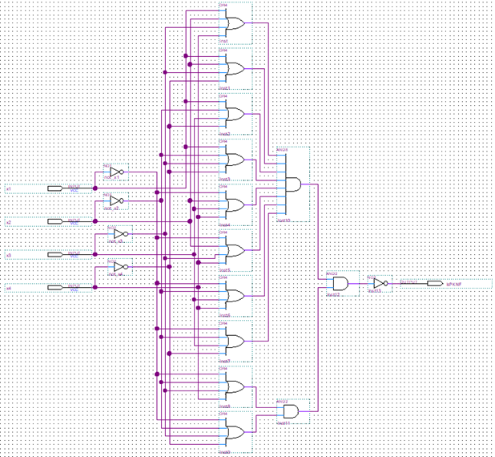

# Course Project: Logic Circuit Design and Simulation

## Overview  
This project focuses on the design and simulation of basic logic gates and the implementation of logic functions using **Perfect Disjunctive Normal Form (PDNF)** and **Perfect Conjunctive Normal Form (PCNF)**. The work is based on digital logic principles and implemented using the VHDL hardware description language in the Quartus Prime development environment.

## Project Demo

<details>
<summary><b>Click to expand</b></summary>

### Logic Gates Schematic Overview


Schematic representation of the logic gates

### PDNF & PCNF Schematic Overview


Schematic representation of PDNF & ~~PKNF~~ PCNF

### Logic Gate: NOT

**Truth table for the NOT gate**

| A | NOT A |
|:-:|:-----:|
| 0 |   1   |
| 1 |   0   |


Schematic representation of PDNF & PCNF

```vhdl
library IEEE;
use IEEE.STD_LOGIC_1164.ALL;
entity NotGate_code is
    Port ( 
        A : in STD_LOGIC;
        Y : out STD_LOGIC);
end NotGate_code;
architecture Behavioral of NotGate_code is
begin
    Y <= NOT A;
end Behavioral;

```

Code representation of the NOT logic gate


Simulation of the NOT logic gate

### Logic Gate: AND

**Truth table for the AND gate**

| A | B | A AND B |
|:-:|:-:|:-------:|
| 0 | 0 |    0    |
| 0 | 1 |    0    |
| 1 | 0 |    0    |
| 1 | 1 |    1    |


Schematic representation of the AND logic gate

```vhdl
library IEEE;
use IEEE.STD_LOGIC_1164.ALL;
entity AndGate_code is
    Port ( 
        A : in STD_LOGIC;
        B : in STD_LOGIC;
        Y : out STD_LOGIC);
end AndGate_code;
architecture Behavioral of AndGate_code is
begin
    Y <= A AND B;
end Behavioral;
```

Code representation of the AND logic gate


Simulation of the AND logic gate

### Logic Gate: OR

**Truth table for the OR gate**

| A | B | A OR B |
|:-:|:-:|:------:|
| 0 | 0 |    0   |
| 0 | 1 |    1   |
| 1 | 0 |    1   |
| 1 | 1 |    1   |


Schematic representation of the OR logic gate

```vhdl
library IEEE;
use IEEE.STD_LOGIC_1164.ALL;
entity OrGate_code is
    Port ( 
        A : in STD_LOGIC;
        B : in STD_LOGIC;
        Y : out STD_LOGIC);
end OrGate_code;
architecture Behavioral of OrGate_code is
begin
    Y <= A OR B;
end Behavioral;
```

Code representation of the OR logic gate


Simulation of the OR logic gate

### PDNF & PCNF

**Truth table for the function f(x1, x2, x3, x4)**

| x1 | x2 | x3 | x4 | f |
|----|----|----|----|---|
| 0  | 0  | 0  | 0  | 1 |
| 0  | 0  | 0  | 1  | 1 |
| 0  | 0  | 1  | 0  | 0 |
| 0  | 0  | 1  | 1  | 0 |
| 0  | 1  | 0  | 0  | 1 |
| 0  | 1  | 0  | 1  | 0 |
| 0  | 1  | 1  | 0  | 1 |
| 0  | 1  | 1  | 1  | 0 |
| 1  | 0  | 0  | 0  | 0 |
| 1  | 0  | 0  | 1  | 1 |
| 1  | 0  | 1  | 0  | 0 |
| 1  | 0  | 1  | 1  | 1 |
| 1  | 1  | 0  | 0  | 0 |
| 1  | 1  | 0  | 1  | 0 |
| 1  | 1  | 1  | 0  | 0 |
| 1  | 1  | 1  | 1  | 0 |


Schematic representation of the PDNF

```VHDL
library IEEE;
use IEEE.STD_LOGIC_1164.ALL;
entity PDNF_code is
    Port ( x1, x2, x3, x4 : in STD_LOGIC; isPDNF : out STD_LOGIC);
end PDNF_code;
architecture Behavioral of PDNF_code is
    function AND4(a, b, c, d: STD_LOGIC) return STD_LOGIC is
    begin
        return a and b and c and d;
    end function;
begin
    isPDNF <= '1' when (
	AND4(not x1, not x2, not x3, not x4) = '1' or  -- 0000
	AND4(not x1, not x2, not x3,     x4) = '1' or  -- 0001
	AND4(not x1,     x2, not x3, not x4) = '1' or  -- 0100
	AND4(not x1,     x2,     x3, not x4) = '1' or  -- 0110
	AND4(    x1, not x2, not x3,     x4) = '1' or  -- 1001
	AND4(    x1, not x2,     x3,     x4) = '1'     -- 1011) else '0';
end Behavioral;
```

Code representation of the PDNF


Simulation of the PDNF



Schematic representation of the ~~PKNF~~ PCNF

```vhdl
library IEEE;
use IEEE.STD_LOGIC_1164.ALL;
entity PKNF_code is
    Port ( x1, x2, x3, x4 : in STD_LOGIC; isPKNF : out STD_LOGIC);
end PKNF_code;
architecture Behavioral of PKNF_code is
    function OR4(a, b, c, d: STD_LOGIC) return STD_LOGIC is
    begin
        return a or b or c or d;
    end function;
begin
    isPKNF <= '0' when (
	OR4(    x1,     x2, not x3,     x4) = '1' and  -- 0010
	OR4(    x1,     x2, not x3, not x4) = '1' and  -- 0011
	OR4(    x1, not x2,     x3, not x4) = '1' and  -- 0101
	OR4(    x1, not x2, not x3, not x4) = '1' and  -- 0111
	OR4(not x1,     x2,     x3,     x4) = '1' and  -- 1000
	OR4(not x1,     x2, not x3,     x4) = '1' and  -- 1010
	OR4(not x1, not x2,     x3,     x4) = '1' and  -- 1100
	OR4(not x1, not x2,     x3, not x4) = '1' and  -- 1101
	OR4(not x1, not x2, not x3,     x4) = '1' and  -- 1110
	OR4(not x1, not x2, not x3, not x4) = '1'      -- 1111) else '1';
end Behavioral;
```

Code representation of the ~~PKNF~~ PCNF


Simulation of the ~~PKNF~~ PCNF

</details>

## Features  
- Implementation of basic logic gates: AND, OR, NOT  
- Development of logic functions in PDNF and PCNF forms  
- Use of structural and schematic modeling (BDF) in Quartus  
- Simulation of logic behavior using waveform files (VWF)  
- Organization of modular code with reusability and clarity

## Technologies Used  
- VHDL – for hardware description  
- Intel Quartus Prime – for synthesis, design entry, and simulation  
- BDF (Block Diagram Files) – for schematic logic design  
- VWF (Vector Waveform Files) – for functional simulation
